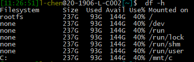

## 前言

Swift是開發iOS app必學的程式語言。mac也是開發必備的工具。

最近開始想學習iOS，但在公司使用的是windows電腦。
稍微調查了一下，雖然還是無法開發iOS app，
但還是有不算麻煩的辦法能在windows環境下使用Swift，
對於想先學習Swift還是有幫助的。
<!-- more -->

---

## Windows Subsystem for Linux (WSL)

除了mac外，Swift的[下載頁面](https://swift.org/download/#releases)本身就有提供Ubuntu版本可供下載。
為此，我們需要使用windows所提供的Subsystem for Linux。

首先以Administrator權限在powershell執行以下指令：

```powershell
Enable-WindowsOptionalFeature -Online -FeatureName Microsoft-Windows-Subsystem-Linux
```

接著就可以在內建的Microsoft Store中安裝需要的Linux系統。
雖然store中提供了許多發行版可以選擇，不過既然Swift直接有Ubuntu版可以下載，在這裡就安裝Ubuntu即可。


安裝完成後，執行Ubuntu即可開啟command line介面使用Ubuntu包括apt等的指令。
若是想要存取windows內的檔案，可以在/mnt裡面找到。



個人是使用soft link的方式將Ubuntu的家目錄與windows上常需要存取的資料夾link起來，例：

```bash
$ ln -s /mnt/c/develop develop
```

## Install Swift on Ubuntu

在安裝Swift之前，我們必須先安裝必要的packages與設置好環境。

```bash
$ sudo apt install clang libicu-dev -y
```

接著在swift下載頁面下載對應的tar

```bash
$ wget https://swift.org/builds/swift-5.0.2-release/ubuntu1804/swift-5.0.2-RELEASE/swift-5.0.2-RELEASE-ubuntu18.04.tar.gz
```

解壓縮後放置於任意處，這裡我放在 `/opt`

```bash
$ tar -xvzf swift-5.0.2-RELEASE-ubuntu18.04.tar.gz -C ~/swift
$ sudo cp -R swift /opt
```

然後將swift加進PATH：

```bash
$ echo "export PATH=/opt/swift/swift-5.0.2-RELEASE-ubuntu18.04/usr/bin:$PATH" >> ~/.bashrc
$ source ~/.bashrc
```

確認Swift已正常安裝，若順利進行，應該可以看到類似這樣的訊息：

```bash
$ swift --version
Swift version 5.0.2 (swift-5.0.2-RELEASE)
Target: x86_64-unknown-linux-gnu
```

可惜的是WSL目前似乎並不支援Swift的互動介面(REPL)，但依然可以使用swift一般的編譯功能

## Build Swift

我們可以使用 `swiftc` 指令編譯單一swift檔案，現在這裡有一份 `hello.swift` 內容如下：

```swift
print("Hello World!")
```

使用swiftc編譯後，執行產生出的`hello`執行檔

```bash
$ swiftc hello.swift
$ ./hello
Hello World!
```

以上就是我在WSL上使用Swift的流程了。

---

## References

- [Windows Subsystem for Linux Installation Guide for Windows 10](https://docs.microsoft.com/en-us/windows/wsl/install-win10)
- [介紹好用工具：WSL (Windows Subsystem for Linux)](https://blog.miniasp.com/post/2019/02/01/Useful-tool-WSL-Windows-Subsystem-for-Linux)
- [Download Swift](https://swift.org/download/#releases)
- [Install Swift 5.0 on Ubuntu 18.04](https://medium.com/@gigmustor/install-swift-5-0-on-ubuntu-18-04-86f6b96654)