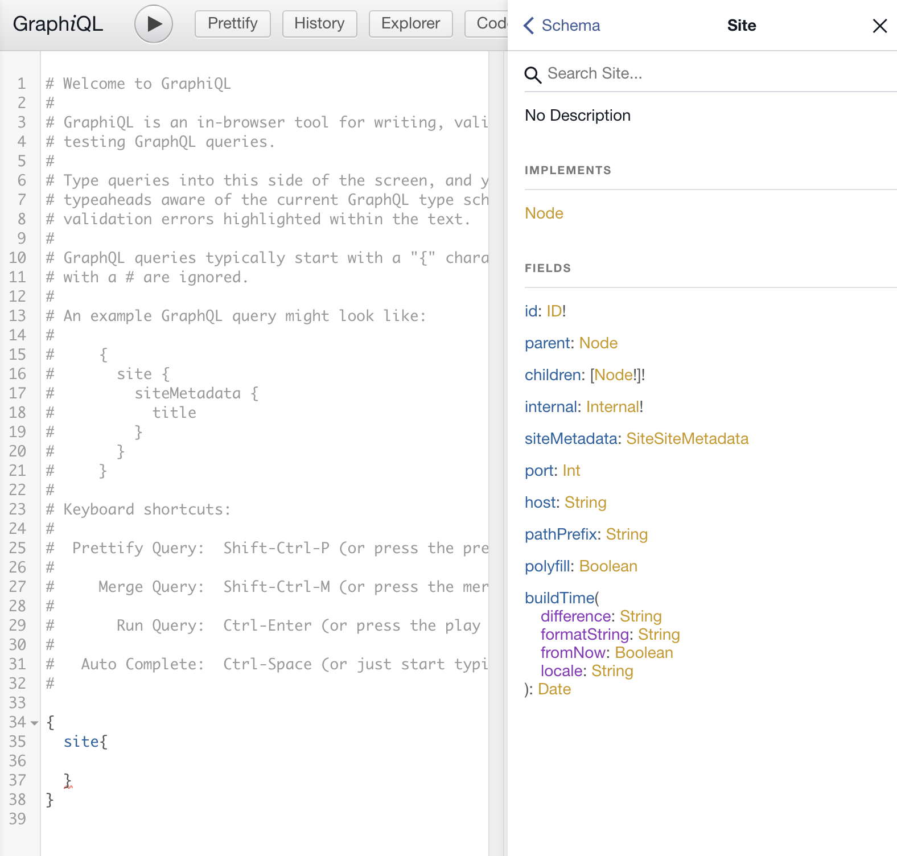

## 前言

使用 Gatsby.js 來產生靜態網頁非常方便，它的賣點就是可以透過 graphQL 以動態網頁的邏輯來撰寫程式碼。

不過，graphQL 雖然方便，有時候的確也有些冗長。
重複出現的部分使用`fragments`就會簡潔許多，這裏簡單介紹如何在 Gatsby 中使用`fragments`

## 使用情境

這是我在某個 page 裡使用了`useStaticQuery`的片段程式碼，
我在這個頁面取得了我在`gatsby-config.js`裡定義的一些關於網站的描述。

```javascript
const data = useStaticQuery(graphql`
  query SiteTitleQuery {
    site {
      siteMetadata {
        title
        description
        author
        socialLinks {
          name
          link
        }
      }
    }
  }
`)
```

雖然不是很長，但如果我有一些頁面想用同樣的東西，每次都寫一樣的內容會讓程式碼看起來還挺亂的。
尤其是當這個 graphQL 中還有很多別的需要 query 的內容的時候。

## 定義 fragment

我們把 query 中常用到的部分定義成一個一個的`fragment`。

Gatsby 非常神奇，你可以在任意一個目錄中宣告這些 fragments，它會自動地被搜尋到。
做個範例，我們現在新增一個檔案`src/fragments/SiteMetaFragment.js`，其內容如下：

```javascript
import { graphql } from "gatsby"

export const SiteMetaFragment = graphql`
  fragment SiteMetaFragment on Site {
    siteMetadata {
      title
      subtitles
      description
      author
      links {
        name
        path
      }
      socialLinks {
        name
        link
      }
    }
  }
`
```

然後在我們本來 query 的地方將內容刪掉，換成 fragment 的名字：

```javascript
const data = useStaticQuery(graphql`
  query SiteTitleQuery {
    site {
      ...SiteMetaFragment
    }
  }
`)
```

可以看到我們就只是 export 了一個變數名，也不知道 export 給誰，沒頭沒腦的宣告。
But，**it just works**

這一切就跟原來一樣，Gatsby 順利地找到對應的 fragment 並拿來使用。

## fragment 的 type

大家可能有注意到，在 fragment 的定義的部分我寫上了`on Site`。
這個部分是代表這個 fragment 在 graphQL 的 type。
當我取用想這樣 built-in 的 type 時，我怎麼知道他叫什麼名字？

Gatsby 的開發者介面提供了一個相當方便的 GUI 介面可以查詢。
在 develop server 啟動時，連進`localhost:8000/__graphql`就可以使用。



我們輸入`site`後，點擊它便可以看見說明，或是就用右邊的搜尋欄位，就可以發現它的 type 就是`Site`了。

## 總結

雖然 fragment 的使用方法官方教學裡就有，但一開始讓我困惑的部分就是 fragment 的「type」是什麼？
還有我該把這些 fragments 放在哪裡？希望能幫助到也有同樣困擾的人。

## References

- [Using GraphQL Fragments](https://www.gatsbyjs.org/docs/using-graphql-fragments/)
