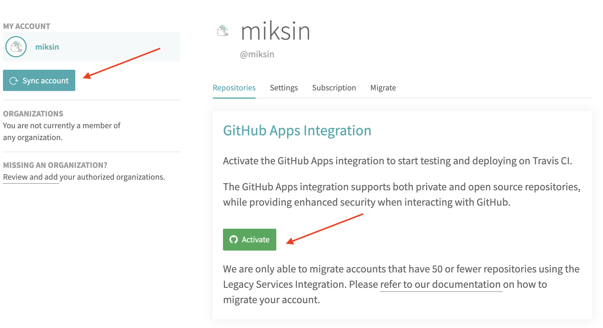
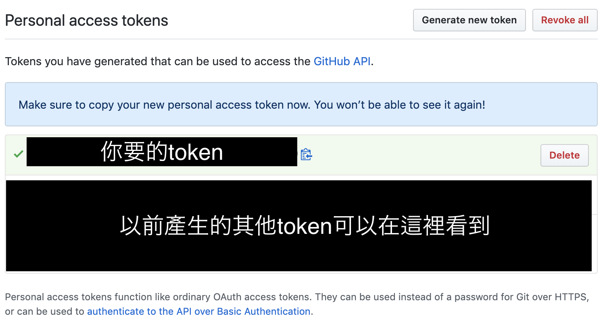
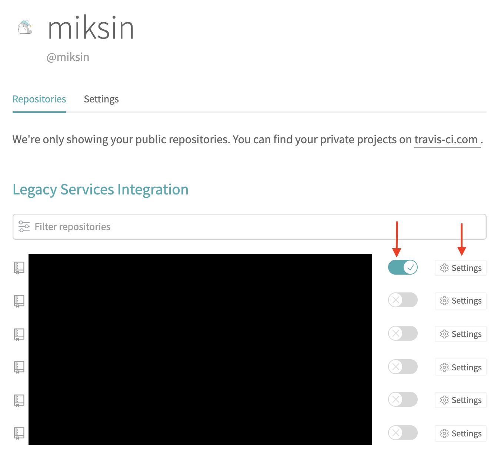
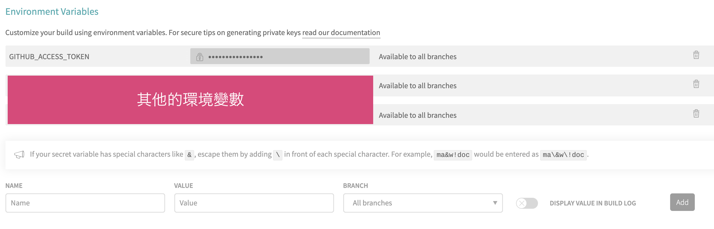

## 前言

GitHub Pages 是個好用且免費的靜態網站空間，只要把你的靜態網站檔案 push 到 gh-pages 這條 branch 就會自動產生靜態網頁。
不過現在幾個流行的前端框架並不是直接就是靜態網頁需要的形式，還需要透過 build 來產生。
因此如果每次 push 上主要開發用的 branch 後，自動在 gh-pages 裡產生靜態網頁檔案就會方便許多了。

## 開始使用 Travis CI

Travis CI 使一個可以與 Github 的 public repository 連動，並自動部署的基本免費服務。
使用這個服務只要做一些簡單的設定即可達成我們要的功能。

首先到[Travis CI](https://travis-ci.com/)的官方網站直接點選「Sign up with GitHub」註冊一個帳號。

點選右上方頭像點選「settings」進入設定畫面。然後 Sync Account 並 Activate。



成功後就可以看見自己現在 GitHub 帳號中有的 repositories 了。

## 取得 GitHub Access Token

在開始設定自動部署前，還需要先在 GitHub 拿到存取用的 access token 才行。
我們直接到[Personal access tokens](https://github.com/settings/tokens)的頁面並點選「Generate new token」。

參考 Travis CI 的[教學](https://docs.travis-ci.com/user/deployment/pages/)，我們至少需要「public_repo」這項權限，勾選他吧！
詳細權限設定的部分可以參考[這裡](https://developer.github.com/apps/building-oauth-apps/understanding-scopes-for-oauth-apps/)。

然後按下「Generate token」即可產生，這個 token 只會顯示這一次而已，要自己記好。



## 設定.travis.yml

然後我們需要在 repository 中放置一個名為`.travis.yml`的檔案來定義我們希望 Travis CI 幫我們做的事以及環境等。

這裡我提供一個我的 Vue 專案的範例：

```yml
language: node_js # 指定語言為node.js 10
node_js:
  - "10"

cache:
  yarn: true
  directories:
    - "node_modules"

branches:
  only:
    - master # 指定當master branch發生變動時才觸發

# 定義觸發後的行為，還有其他像是before_install等callback
install:
  - yarn install
  - yarn run build

script:
  - echo "Skipping tests"

deploy:
  provider: pages
  skip-cleanup: true
  github-token: $GITHUB_ACCESS_TOKEN # 這裏到時候會在環境設定我們在GitHub拿到的Access Token
  target-branch: gh-pages # 把build出來的檔案push進GitHub Pages用的branch
  local-dir: dist # Vue專案預設build到的資料夾，當然這是可以更動的
  on:
    branch: master
```

更多設定可以參考官方的[Customizing the Build](https://docs.travis-ci.com/user/customizing-the-build)。

## 設定環境變數與啟動自動部署

回到 Travis CI 的 [repo 一覽](https://travis-ci.org/account/repositories)，
把想要自動部署的 repo 的開關打開，並進入 Settings 來設定環境變數。



在設定頁面我們需要把剛才在 GitHub 拿到的 Access Token 設定在環境變數中，變數名要與 travis.yml 中設定的相同。
這是為了避免 token 直接寫在檔案裡會被公開的疑慮，所以這裏設定環境變數時也記得不要將它顯示出來。



然後嘗試 push 新的 commit 到 master branch 或是手動點選「Trigger build」看看是不是如預期的動作囉！

## References

- [Travis CI](https://travis-ci.com/)
- [Creating a personal access token for the command line](https://help.github.com/en/github/authenticating-to-github/creating-a-personal-access-token-for-the-command-line)
- [GitHub Pages Deployment](https://docs.travis-ci.com/user/deployment/pages/)
- [Understanding scopes for OAuth Apps](https://developer.github.com/apps/building-oauth-apps/understanding-scopes-for-oauth-apps/)
- [Customizing the Build](https://docs.travis-ci.com/user/customizing-the-build)
